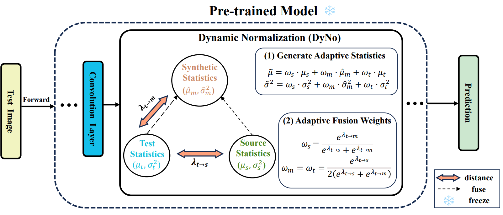

# DyNo

This is the official pytorch implementation of our paper "[DyNo: Dynamic Normalization based Test-Time
Adaptation for 2D Medical Image Segmentation](https://link.springer.com/chapter/10.1007/978-3-031-73284-3_27)".




## Environment

```
Python 3.7
Cuda 11.1
batchgenerators 0.21
MedPy 0.4.0
numpy 1.21.6
openpyxl 3.1.2
pandas 1.1.5
Pillow 9.5.0
scipy 1.7.3
torch 1.8.0
torchvision 0.9.0
```

## Preparation

The preprocessed data and pre-trained models can be downloaded from [Google Drive](https://drive.google.com/drive/folders/1O_GOgEGC3qZNgfXQiKKz1rcD97h5sY3r?usp=sharing).

## How to Run

```shell
python dyno.py
--path_save_model "Set The Pre-trained Model Path"
--path_save_log "Set Results Path"
--dataset_root "Set Datasets Path"
```

Run `dyno.py` to perform test-time adaptation for both OD/OC and polyp segmentation tasks.

After running, an excel file stored in the `[path_save_log]/TTA` directory. Each cell represents the performance of the source pre-trained model tested on the target domain, with row indicating the source domain and column indicating the target domain.

See `dyno.py` for more details.

## Contact

Yihang Fu (yhfu.nwpu@gmail.com)